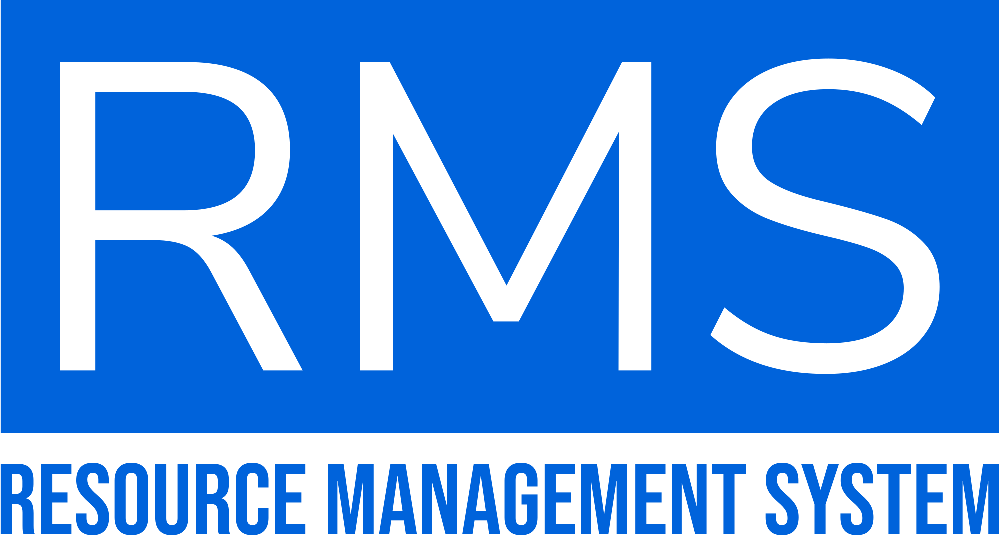
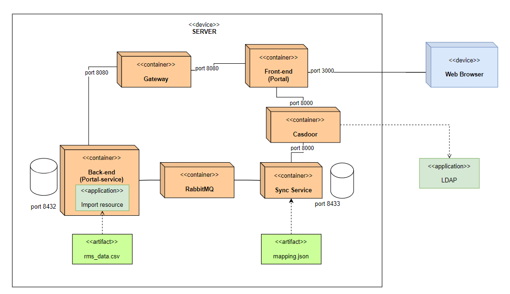
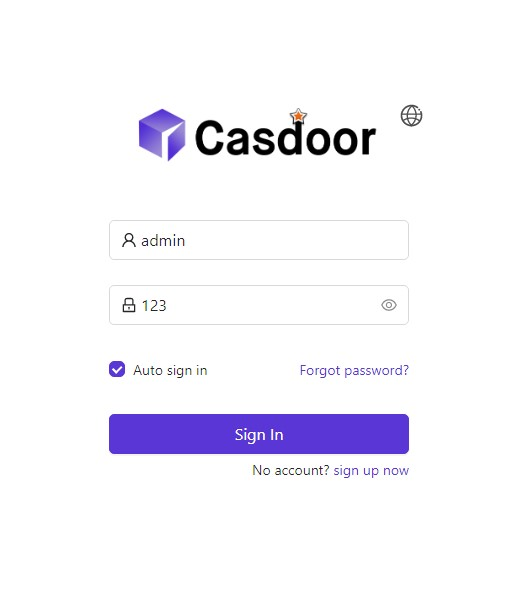
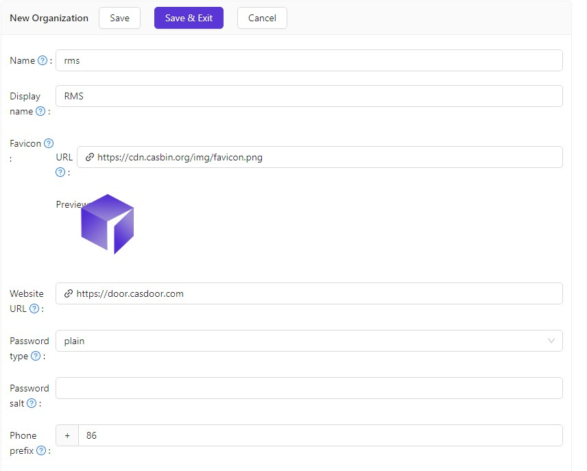
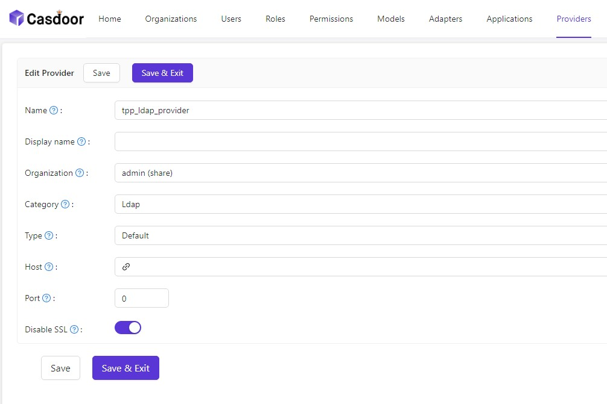
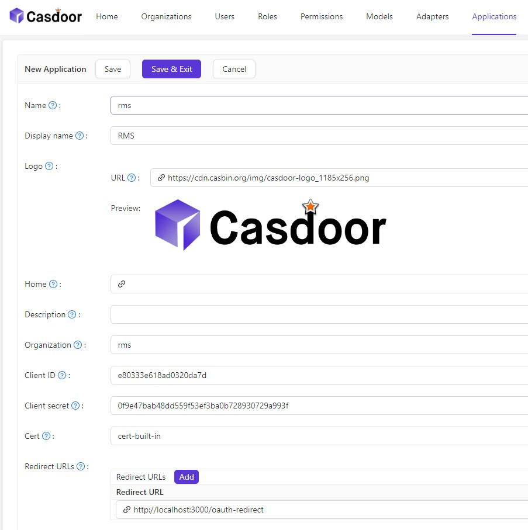
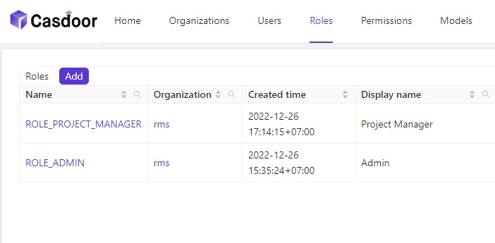
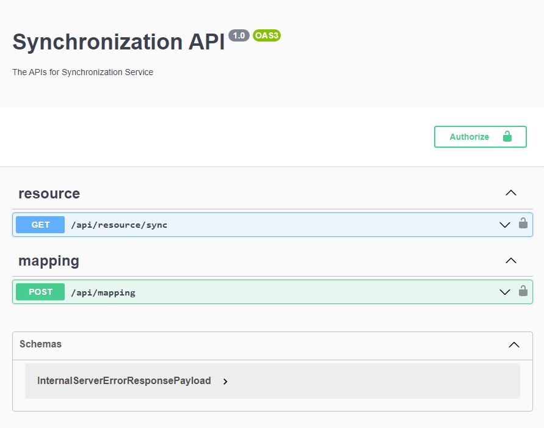

# Resources Management System (RMS) Operations Guideline

<div>
  <p align="center">
     
  </p>
</div>

## Table of contents

- [Resources Management System (RMS) Operations Guideline](#resources-management-system-rms-operations-guideline)
	- [Table of contents](#table-of-contents)
	- [Overview](#overview)
	- [Requirements](#requirements)
	- [Installation](#installation)
		- [Clone the repository:](#clone-the-repository)
		- [Define environment variables (optional):](#define-environment-variables-optional)
		- [Run the deployment script:](#run-the-deployment-script)
		- [After successful deployment, Casdoor needs to be initialized:](#after-successful-deployment-casdoor-needs-to-be-initialized)
		- [Synchonize the backend's database:](#synchonize-the-backends-database)
		- [Access the frontend service:](#access-the-frontend-service)
		- [Import additional data (skills, departments,...):](#import-additional-data-skills-departments)

## Overview

The following diagram shows how RMS works at high-level:




## Requirements
- Hardware: 4GB RAM, 2 CPUs, 1GB disk space
- Docker installed

## Installation

### Clone the repository:
```    
$ git clone <deploy repo source>
```
The cloned repository contains the following files and folders:
```
deploy									# root folder  
│   README.md							# this file  
│   .env								# environment variables file  
│   deploy.sh							# deployment script  
│   rms.sh								# rms service script  
│   sync.sh								# sync service script  
│   gateway.sh							# gateway service script  
│   portal.sh							# portal service script  
│   import_data.sh						# import data script  
│
└───rms-ops								# root folder for rms-ops  
│	│  
│	└───import-data						# root folder for import-data  
│	│  
│	└───rms-gateway						# root folder for rms-gateway  
│	│  
│	└───rms-portal						# root folder for rms-portal  
│	│  
│	└───rms-portal-service				# root folder for rms-portal-service  
│	│  
│	└───rms-synchronization-service		# root folder for rms-synchronization-service  
└───img									# images folder for this file  
```
### Define environment variables (optional):  

Modify the `.env` file to set the environment variables (optional). Note that the default values are already set in the file, and gateway_port should not be changed under any circumstances.  

### Run the deployment script:  
```
$ ./deploy.sh
```
The script will auto create the services' Docker containers as follow:  
- 'rms-portal': the frontend service, runs on port 3000 by default.  
- 'rms_gateway_prod': the gateway service, runs on port 8080 by default.  
- 'casdoor_prod': the authentication service, runs on port 8000 by default.  
- 'casdoor_db_prod': the database service for casdoor.  
- 'rms_api_prod': the backend service, runs on port 4000 by default.  
- 'flyway_prod': the database migration service for backend service.  
- 'timeline_db_prod': the database service for backend service, runs on port 8432 by default.  
- 'synchronization_api_prod': the sync service to synchronize backend's database, runs on port 4002 by default.  
- 'synchronization_db_prod': the database service for sync service, runs on port 8433 by default.  
- 'synchronization_flyway_prod': the database migration service for sync service.  
- 'rabbitmq': the message queue service for sync service. By default, port 5672 is used for AMQP protocol and port 15672 is used for management UI.  

### After successful deployment, Casdoor needs to be initialized:
- Open the Casdoor UI at `http://localhost:8000` and login with default username `admin` and password `123`. Use proper port if it is changed in the environment variables file.  
	  
- Create organization (e.g. Name: `rms`) and click Save.  
	  
- Scroll down to the bottom of the page and click `Add` in Ldaps section.  
- Setup the LDAP server information and click Save. Note that Auto Sync should be set at 1 minutes at first, after the first sync, it can be set to 1440 minutes (24h per sync), due to the fact that manual sync is currently not supported by Casdoor. If sync works properly, the user list should be shown in the Users tab.  
- Navigate to the Providers tab and click `Add` to create a new provider:  
  	```
	Organization: admin (share)
  	Category: Ldap
  	Host and Port: the same as the LDAP server
  	SSL: enabled
	```
	  
- Navigate to the Applications tab and click `Add` to create a new application.  
		  
  	- Organization name should be the same as the one created in the previous step.  
  	- The Client ID and Client secret should be the same as the ones defined in the environment variables file; and the Redirect URL should be `http://localhost:3000/oauth-redirect`. Use proper port (portal_port) if it is changed in the environment variables file.  
  	- Providers: Select the provider created in the previous step.  
  	- After done, click Save & Exit.  
- Navigate to Roles tab and click `Add` to create a new role (2 roles required):  
		  
  	- Organization name should be the same as the one created in the previous step.  
  	- Name should be `ROLE_ADMIN` or `ROLE_PROJECT_MANAGER`.  
  	- Click Save & Exit and Edit to continue config (Casdoor's bug). Otherwise, Sub users won't show properly.  
  	- Click Sub users and select desired users for each role. Users with no roles will be set as `ROLE_EMPLOYEE` by default when logging into the frontend service.  
- Create a Token for sync service:  
		  
  	- Navigate to Tokens tab and click `Add` to create a new token.  
  	- Keep default settings and fill in Access token. Note that this should be the same as casdoor_token (default is `0123456789`) defined in the environment variables file.  
- Create a Token for backend service (optional):  
  	- Navigate to Tokens tab and click `Add` to create a new token.  
  	- Keep default settings and fill in Access token. This will be used later to authorize the backend service.  

### Synchonize the backend's database:  
- Navigate to sync service's Swagger at `http://localhost:4002/api/explorer`. Use proper port (synchronization_api_port) if it is changed in the environment variables file.  
	  
- Authorize with the token created for sync service in the previous step.  
- Access `POST /api/mapping` endpoint and click `Try it out`.  
- Select mapping file (sample file in `rms-ops/rms-synchronization-service/config/` folder) and click `Execute`.  
- Access `GET /api/resource/sync` endpoint and click `Try it out`.  
- `Execute` to synchronize the database.  
- The backend's database should be automatically synchronized with the LDAP server.  

### Access the frontend service:  
- Open the frontend service at `http://localhost:3000`. Use proper port (portal_port) if it is changed in the environment variables file.  
- Login with an LDAP account.  
- After login successfully, Admin and PM accounts (defined on Casdoor) can access all the pages. The rest (employee accounts) can only access Timesheet page.  

### Import additional data (skills, departments,...):  
- Navigate to `deploy/rms-ops/import-data` folder.  
- Place the data file in the `data` subfolder to import. A sample file can be found there.  
- Run the `import-data.sh` script in the base directory to import the data.  
	```
	$ ./import-data.sh
	```
